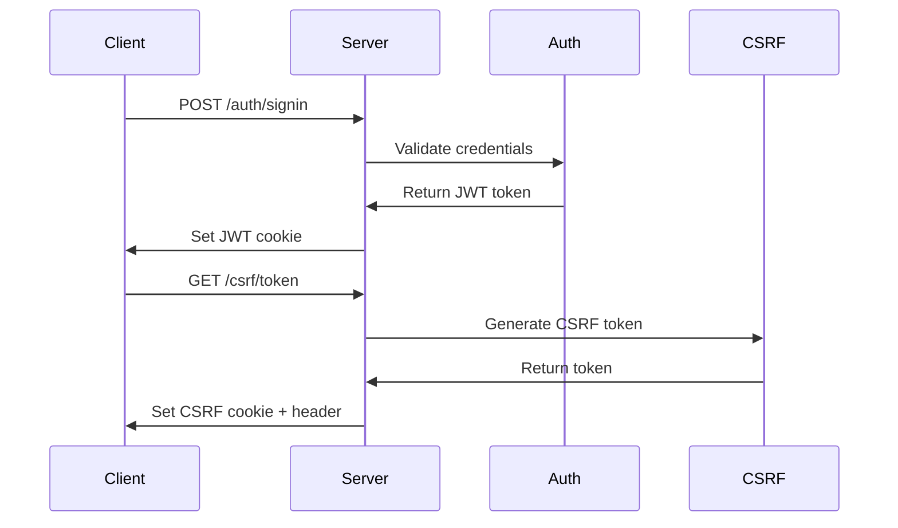
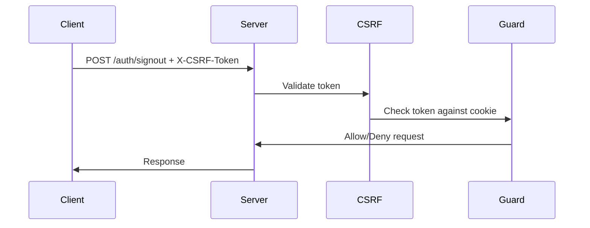

# CSRF Protection Implementation

This document explains the CSRF (Cross-Site Request Forgery) protection implementation for the JWT cookie-based authentication system.

## Overview

CSRF protection prevents malicious websites from making unauthorized requests on behalf of authenticated users. The implementation uses:

- **Double Submit Cookie Pattern**: CSRF tokens stored in HttpOnly cookies and sent via headers
- **Automatic Token Generation**: Tokens generated after authentication
- **State-Changing Operation Protection**: All POST, PUT, DELETE, PATCH operations require CSRF tokens
- **Timing-Safe Validation**: Prevents timing attacks during token comparison

## Architecture

### Components

1. **CsrfService** (`src/services/csrf.service.ts`)
   - Generates cryptographically secure tokens
   - Validates tokens with timing-safe comparison
   - Manages token expiry

2. **CsrfGuard** (`src/guards/csrf.guard.ts`)
   - Protects state-changing operations
   - Validates CSRF tokens from headers
   - Skips validation for safe operations (GET, OPTIONS)

3. **CsrfMiddleware** (`src/middlewares/csrf.middleware.ts`)
   - Automatically generates CSRF tokens for authenticated users
   - Sets tokens in HttpOnly cookies and response headers
   - Handles token refresh and expiry

4. **CsrfController** (`src/controllers/csrf.controller.ts`)
   - Provides endpoints for token management
   - Handles token generation, refresh, and validation

5. **CsrfModule** (`src/modules/csrf.module.ts`)
   - Organizes all CSRF components
   - Applies middleware globally

## How It Works

### 1. Authentication Flow



### 2. Protected Request Flow



## API Endpoints

### CSRF Token Management

#### GET `/csrf/token`
Generate a new CSRF token for authenticated users.

**Headers Required:**
- `Cookie: access_token=<jwt>`

**Response:**
```json
{
  "message": "CSRF token generated successfully",
  "expiresAt": "2024-01-01T12:00:00.000Z"
}
```

**Headers Set:**
- `X-CSRF-Token: <token>`
- `Set-Cookie: csrf_token=<token>; HttpOnly; ...`

#### POST `/csrf/refresh`
Refresh the current CSRF token.

**Headers Required:**
- `Cookie: access_token=<jwt>`
- `X-CSRF-Token: <current-token>`

**Response:**
```json
{
  "message": "CSRF token refreshed successfully",
  "expiresAt": "2024-01-01T12:00:00.000Z"
}
```

#### POST `/csrf/validate`
Validate a CSRF token.

**Headers Required:**
- `Cookie: csrf_token=<stored-token>`
- `X-CSRF-Token: <token-to-validate>`

**Response:**
```json
{
  "message": "CSRF token is valid",
  "valid": true
}
```

## Frontend Integration

### JavaScript/Fetch API

```javascript
class CsrfManager {
  constructor() {
    this.csrfToken = null;
  }

  // Get CSRF token after login
  async getCsrfToken() {
    const response = await fetch('/csrf/token', {
      credentials: 'include'
    });
    
    this.csrfToken = response.headers.get('X-CSRF-Token');
    return this.csrfToken;
  }

  // Make protected request
  async makeProtectedRequest(url, options = {}) {
    if (!this.csrfToken) {
      await this.getCsrfToken();
    }

    return fetch(url, {
      ...options,
      credentials: 'include',
      headers: {
        ...options.headers,
        'X-CSRF-Token': this.csrfToken
      }
    });
  }

  // Refresh token if needed
  async refreshToken() {
    const response = await fetch('/csrf/refresh', {
      method: 'POST',
      credentials: 'include',
      headers: {
        'X-CSRF-Token': this.csrfToken
      }
    });
    
    this.csrfToken = response.headers.get('X-CSRF-Token');
    return this.csrfToken;
  }
}

// Usage
const csrf = new CsrfManager();

// After login
await csrf.getCsrfToken();

// Make protected request
await csrf.makeProtectedRequest('/auth/signout', {
  method: 'POST'
});
```

### React Hook

```typescript
import { useState, useEffect, useCallback } from 'react';

interface UseCsrfReturn {
  csrfToken: string | null;
  getCsrfToken: () => Promise<string>;
  refreshToken: () => Promise<string>;
  makeProtectedRequest: <T>(
    url: string, 
    options?: RequestInit
  ) => Promise<T>;
}

export const useCsrf = (): UseCsrfReturn => {
  const [csrfToken, setCsrfToken] = useState<string | null>(null);

  const getCsrfToken = useCallback(async (): Promise<string> => {
    const response = await fetch('/csrf/token', {
      credentials: 'include'
    });
    
    const token = response.headers.get('X-CSRF-Token');
    if (token) {
      setCsrfToken(token);
      return token;
    }
    throw new Error('Failed to get CSRF token');
  }, []);

  const refreshToken = useCallback(async (): Promise<string> => {
    if (!csrfToken) {
      return getCsrfToken();
    }

    const response = await fetch('/csrf/refresh', {
      method: 'POST',
      credentials: 'include',
      headers: {
        'X-CSRF-Token': csrfToken
      }
    });
    
    const token = response.headers.get('X-CSRF-Token');
    if (token) {
      setCsrfToken(token);
      return token;
    }
    throw new Error('Failed to refresh CSRF token');
  }, [csrfToken, getCsrfToken]);

  const makeProtectedRequest = useCallback(async <T>(
    url: string, 
    options: RequestInit = {}
  ): Promise<T> => {
    if (!csrfToken) {
      await getCsrfToken();
    }

    const response = await fetch(url, {
      ...options,
      credentials: 'include',
      headers: {
        ...options.headers,
        'X-CSRF-Token': csrfToken!
      }
    });

    if (response.status === 401) {
      // Token might be expired, try to refresh
      await refreshToken();
      // Retry request with new token
      return fetch(url, {
        ...options,
        credentials: 'include',
        headers: {
          ...options.headers,
          'X-CSRF-Token': csrfToken!
        }
      }).then(res => res.json());
    }

    return response.json();
  }, [csrfToken, getCsrfToken, refreshToken]);

  return {
    csrfToken,
    getCsrfToken,
    refreshToken,
    makeProtectedRequest
  };
};
```

## Environment Configuration

### Required Variables

```bash
# CSRF Configuration
CSRF_SECRET=your-strong-csrf-secret-key
CSRF_TOKEN_EXPIRY_HOURS=24

# JWT Configuration (required for CSRF)
JWT_ACCESS_SECRET=your-jwt-secret
JWT_ACCESS_EXPIRES_IN=15m
```

### Optional Variables

```bash
# CSRF token expiry (default: 24 hours)
CSRF_TOKEN_EXPIRY_HOURS=12

# Environment (affects cookie security)
NODE_ENV=production
```

## Security Features

### 1. Token Generation
- **Cryptographically Secure**: Uses `crypto.randomBytes(32)` for token generation
- **User-Specific**: Tokens include user ID and timestamp for uniqueness
- **Configurable Expiry**: Tokens expire after configurable time period

### 2. Token Storage
- **HttpOnly Cookies**: Prevents XSS attacks from stealing tokens
- **Secure Flag**: Enforced in production for HTTPS-only transmission
- **SameSite Policy**: Properly configured for cross-origin requests

### 3. Token Validation
- **Timing-Safe Comparison**: Prevents timing attacks during validation
- **Header Validation**: Accepts both `X-CSRF-Token` and `X-XSRF-Token` headers
- **Cookie Validation**: Compares against stored HttpOnly cookie

### 4. Operation Protection
- **State-Changing Operations**: All POST, PUT, DELETE, PATCH operations protected
- **Safe Operations**: GET and OPTIONS requests bypass CSRF validation
- **Authentication Required**: CSRF protection only applies to authenticated users

## Testing

### Run CSRF Tests

```bash
# Run all CSRF tests
pnpm test:e2e --testNamePattern="CSRF Protection"

# Run specific test suite
pnpm test:e2e test/csrf.e2e-spec.ts
```

### Test Coverage

The CSRF tests cover:
- Token generation and management
- Token validation and refresh
- Protection on state-changing operations
- Security against invalid/missing tokens
- Header acceptance and validation

## Troubleshooting

### Common Issues

#### 1. CSRF Token Missing Error
**Problem**: `CSRF token missing` error on protected operations

**Solution**: Ensure CSRF token is included in request headers
```javascript
headers: {
  'X-CSRF-Token': csrfToken
}
```

#### 2. CSRF Token Invalid Error
**Problem**: `CSRF token invalid` error

**Solution**: 
- Check if token has expired
- Ensure token is being sent correctly
- Verify cookie is being sent with request

#### 3. Token Not Generated
**Problem**: No CSRF token after authentication

**Solution**: 
- Call `/csrf/token` endpoint after login
- Ensure JWT cookie is being sent
- Check authentication status

#### 4. CORS Issues with CSRF
**Problem**: CORS errors when sending CSRF tokens

**Solution**: 
- Ensure `credentials: 'include'` is set
- Verify CORS configuration allows credentials
- Check cookie SameSite and Secure settings

### Debug Mode

Enable debug logging by setting environment variable:
```bash
DEBUG_CSRF=true
```

This will log:
- Token generation events
- Validation attempts
- Token expiry information

## Best Practices

### 1. Frontend Implementation
- Always include CSRF tokens in state-changing requests
- Handle token refresh automatically
- Store tokens securely (don't expose in localStorage)
- Implement retry logic for expired tokens

### 2. Security Considerations
- Use HTTPS in production
- Regularly rotate CSRF secrets
- Monitor for suspicious token usage
- Implement rate limiting on CSRF endpoints

### 3. Performance
- Cache CSRF tokens appropriately
- Minimize token refresh frequency
- Use efficient token validation
- Consider token pooling for high-traffic applications

## Migration Guide

### From No CSRF Protection

1. **Install Dependencies**: Already done
2. **Update Environment**: Add CSRF configuration
3. **Update Frontend**: Include CSRF tokens in requests
4. **Test**: Run CSRF tests to verify functionality

### From Other CSRF Libraries

1. **Remove Old Implementation**: Uninstall previous CSRF libraries
2. **Update Guards**: Replace old CSRF guards with new ones
3. **Update Frontend**: Modify token handling if needed
4. **Test**: Verify all protected operations work correctly

## Future Enhancements

### Planned Features
- **Token Rotation**: Automatic token rotation for enhanced security
- **Rate Limiting**: Built-in rate limiting for CSRF endpoints
- **Analytics**: CSRF attack detection and reporting
- **Multi-Token Support**: Support for multiple active tokens per user

### Customization Options
- **Token Format**: Configurable token generation algorithms
- **Validation Rules**: Custom validation logic support
- **Storage Backend**: Alternative storage mechanisms (Redis, database)
- **Integration**: Third-party security service integration
